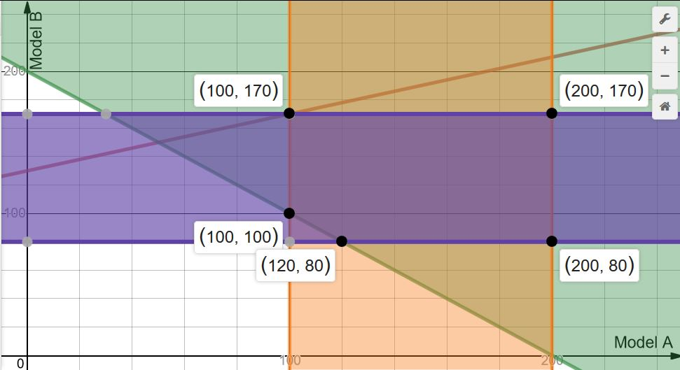

##Linear Programming
Linear programming is a simple technique where we illustrate complex relationships through linear functions and solve some very complex optimization problems by making a few simplifying assumptions.

Linear programming(LP) is optimization of an objective function based on some set of constraints, bounds using a linear mathematical model. An objective function defines the quantity to be optimized, and the goal of linear programming is to find the values of the variables that maximize or minimize the objective function.

Linear programming is often used in business to maximize profit or minimize cost. The first step in solving linear programming problems is to set up a objective function that represents cost, profit, or some other quantity to be maximized or minimized subject to the constraints of the problem. Then we have to define the constraints with a system of linear inequalities. The solution of these systems of inequalities is called the feasible solution. Graph the inequalities to determine the coordinates of the vertices of the region to get the feasible region. Evaluate the function at each vertex. The largest and smallest of those values are the maximum and minimum values of the function, respectively.

**constraint** - A constraint is an inequality that defines how the values of the variables in a problem are limited. In order for linear programming techniques to work, all constraints should be linear inequalities.

**objective function** - The objective function is a function that defines some quantity that should be minimized or maximized. The arguments of the objective function are the same variables that are used in the constraints. In order for linear programming techniques to work, the objective function should be linear. 

**Decision Variables** - The decision variables are the variables which will decide the output. To solve any linear problem, we first need to identify the decision variables. 

###When to use Linear Programming###
Linear programming can be used to solve a problem when the goal of the problem is to maximize or minimize some value and there is a linear system of inequalities that defines the constraints on the problem. 

Linear programming is useful for many problems that require an optimization of resources. It could be applied to manufacturing, to calculate how to assign labor and machinery to minimize cost of operations. It could be applied in high-level business operations, to decide which products to sell and in what quantity in order to maximize profit. It could also be applied in logistics, to decide how to apply resources to get a job done in the minimum amount of time.

###Example of a linear programming problem###
A car company produces 2 models, model A and model B. Long-term projections indicate an expected demand of at least 100 model A cars and 80 model B cars each day. Because of limitations on production capacity, no more than 200 model A cars and 170 model B cars can be made daily. To satisfy a shipping contract, a total of at least 200 cars much be shipped each day. If each model A car sold results in a $2000 loss, but each model B car produces a $5000 profit, how many of each type should be made daily to maximize net profits?

A linear program can be solved by multiple methods. Now, we are going to look at the Graphical method for solving a linear program. This method is used to solve a two variable linear program. If you have only two decision variables, you should use the graphical method to find the optimal solution.

A graphical method involves formulating a set of linear inequalities subject to the constraints. Then the inequalities are plotted on a X-Y plane. Once we have plotted all the inequalities on a graph the intersecting region gives us a feasible region. The feasible region explains what all values our model can take. And it also gives us the optimal solution.

**Solution** The first thing we have to do is represent the problem in a tabular form for better understanding.

```{r kable,echo=FALSE,warning=FALSE,fig.align='center',fig.width=0.02}
Model<-c("A","B")
Demand<-c(100,80)
Pro_Capacity<-c(200,170)
Profit<-c(-2000,5000)
Table<-data.frame(Model,Demand,Pro_Capacity,Profit)
library(knitr)
library(kableExtra)
options(knitr.table.format = "html") 
kable(Table, "html",caption = "Production Constrain Table") %>%
  kable_styling(bootstrap_options = "striped", full_width = F)
```

**Formulation of Linear Problem**

1. Identify the decision variables
2. Write the objective function
3. Writing the constraints 
4. The non-negativity restriction

A and B are the decision variables

Now Define the Objective Function. As the main objective of Linear programming is to Minimize Cost or Maximize Profit.In this problem we have to maximize the profit P. 

$$ P = -2000A+5000B $$

As the company has to satisfy a shipping contract, a total of at least 200 cars must be shipped each day. So the total no.of cars has to be shipped from model A and B
$$ Shipping\: Constrain = A+B \geq 200 $$
The company will try to produce as many units of B to maximize the profit and less number of Model A cars. But the limitation of production capacity and the demand are the constrains so we need to define them too
$$ Limitation \: on\: model\:A= 100 \leq A \leq  200 $$
$$ Limitation \: on\: model\:B= 80 \leq B \leq 170 $$

Also, the values for units of A and B can only be non negative integers.

So we have two more constraints
$$ A\geq0, B\geq0$$
For the company to make maximum profit, the above inequalities have to be satisfied.

Since the model is set up in two dimensional plane, we can actually see what we are intending to do. Let us draw the region formed by the restrictions on
x and y.

{width=700px}


The portion in black dots is the collection of points (x,y) satisfying
        $$100 \leq x \leq 200$$
        $$80 \leq y \leq 170$$
        $$ x+y \geq 200 $$

Now, what we want is to maximize P=-2000A+ 5000B in this domain(i.e. the region inside the black dots)only. In other words we wish to find a pair (x,y) which lies in the black dotted region and provide the maximum value of our goal function P=-2000x+ 5000y.

Though there are infinite points in the identified region and testing of each and every one of them is not a good idea, we need to design a strategy which can find answer to our objective in a more simple way. Let us see how the objective function behaves on the 'corner points' of the shaded region.

Let us tabulate the results

Points  | Value of P
------------- | -------------
(120,80)  | 160,000
(200,80)  | 0
(200,170)  | 450,000
(100,170) | 650,000
(100,100)  | 300,000

From these five values(only), we can clearly make out that the best one is (100,
170) with the maximum value of -2000x + 50000y as 650,000.

Although, we have not checked it but just by looking at the above graph we can
atleast guess and get confident about our guess that no matter what other point (x,y) we select in the shaded region, the maximum value still remains 650,000 and no further improvement(or enhancement) is possible in it within the black dotted region.

We can conclude that the company should manufacture 100 Model A and 170 Model B Cars to get the best daily profit of  $650,000 within the limitations of the company.

##Linear programming in R

This section describe how R in conjunction with the lpSolveAPI package, can be used to build a linear programming model and to analyse its results.

The lpSolveAPI package provides a complete implementation of linear programming.

Let's load the necessary libraries.

```{r warning=FALSE}

# Install lpsolveAPI library if not installed
library("lpSolveAPI")
```
First Create Empty LP model with 0 constraints and 2 decision variables.

```{r}
lprec <- make.lp(0, 2)
```
set objective direction sense='max' as we want to maximize the profit
```{r results=FALSE}
lp.control(lprec, sense="max")
```
set objective Function for two variables 
```{r}
set.objfn(lprec, c(-2000, 5000))
```
Setting up the constraints
$A+B \geq 200$ at least 200 cars must be shipped each day,
$100 \leq A \leq 200$ demand of at least 100 and limitations on production capacity is 200 on model A cars,
$80 \leq B \leq 170$ demand of at least 80 and limitations on production capacity is 170 on model B cars.
```{r}
add.constraint(lprec, c(1, 1), ">=",200)
add.constraint(lprec, c(1,0), ">=", 100)
add.constraint(lprec, c(1,0), "<=", 200)
add.constraint(lprec, c(0,1), ">=", 80)
add.constraint(lprec, c(0,1), "<=", 170)
RowNames <- c("Shipment", "ProCapacity_A", "Demand_A","ProCapacity_B", "Demand_B")
ColNames <- c("A", "B")
dimnames(lprec) <- list(RowNames, ColNames)
name.lp(lprec,"Max Car Production")
```
So, let's have a look at the 'lprec' file.
```{r}
lprec
```
This is the exact model table we wanted to create.
Solve the problem, if the retrun value is 0 Then model was successful and optimal  solution is found.
```{r}
solve(lprec)
```
the below function shows a maximum total profit we can get by the model.
```{r}
get.objective(lprec)
```
Get the solution as how many model A and B cars to be produced to get more profit.
```{r}
get.variables(lprec)
```
For, to achieve the maximum profit $650000, the compant should produce 100 model A cars and 170 model B cars. The result exactly matches with the graphical method.

In order to be able to visually check the model, it is recommended to write the model to a text file.
```{r}
write.lp(lprec,'model.lp',type='lp')
```